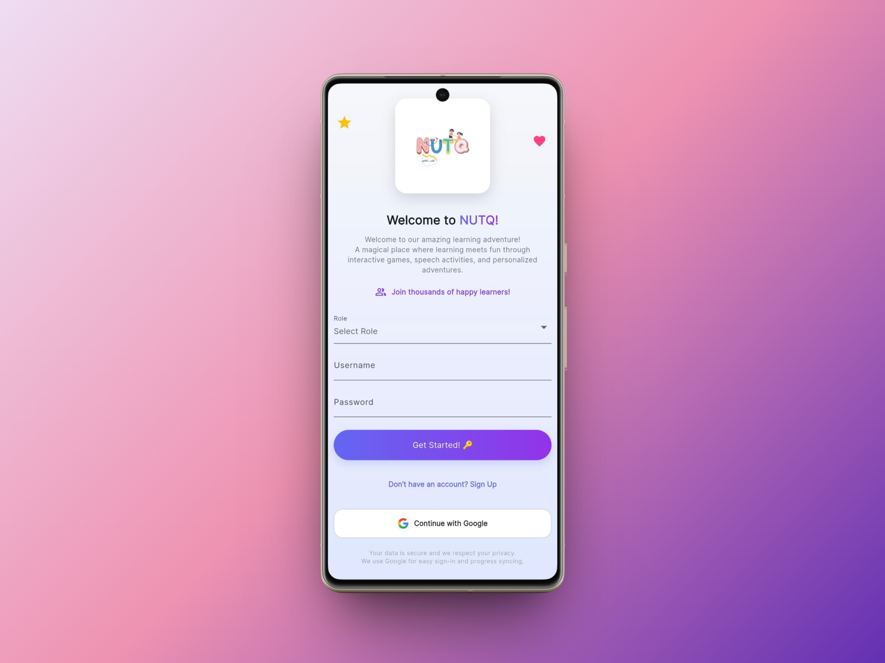
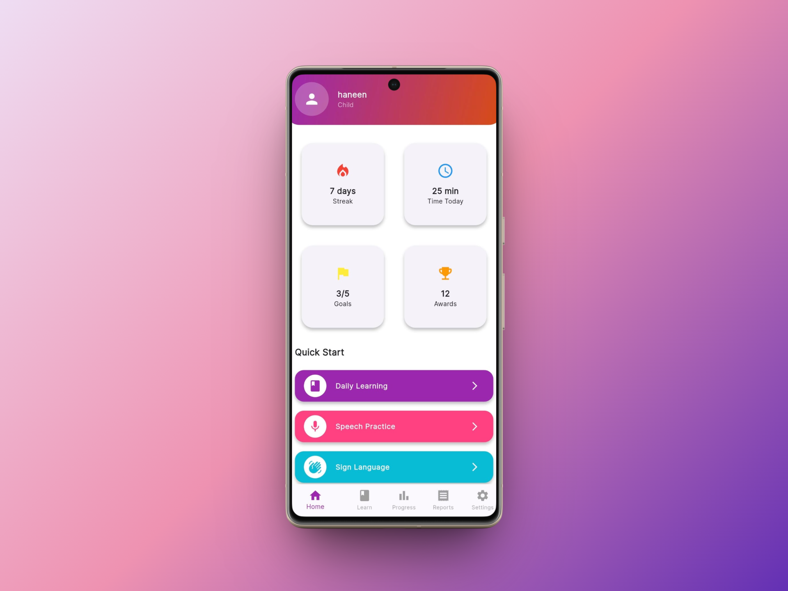
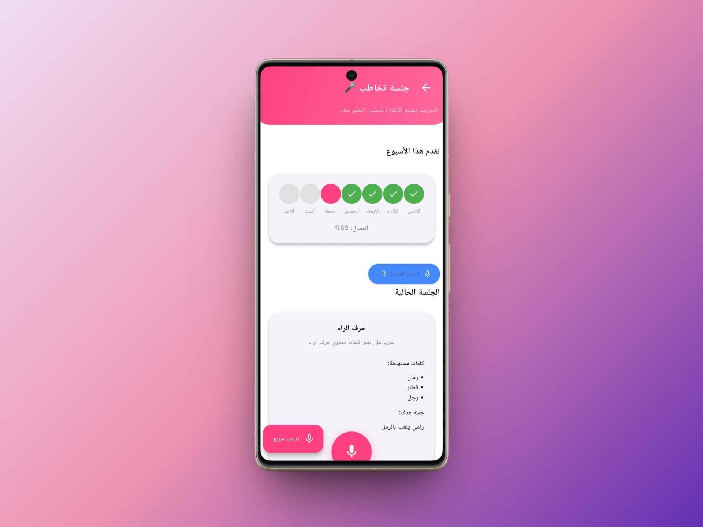
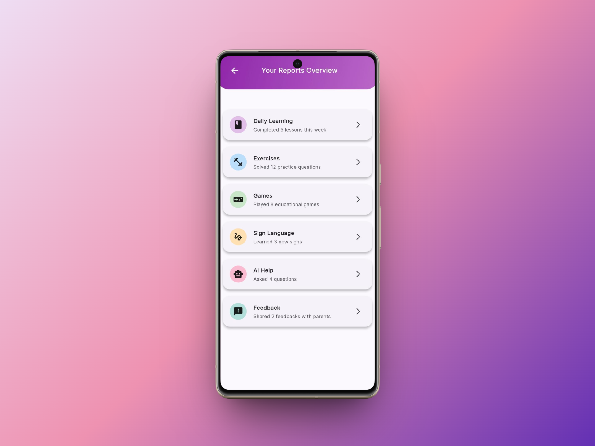

# 🎯 NutqApp - AI-Powered Speech Therapy & Sign Language

AI-powered speech therapy and sign language learning platform for children.


## 📱 Screenshots

 |  |  | 
---|---|---|---

## ✨ Key Features

- 🎤 **Speech Therapy** - Real-time Arabic speech recognition with instant feedback using **Whisper API**.
- 🖐️ **Sign Language** - Real-time AI gesture detection using **TensorFlow Lite** and a **Python WebSocket Server**.
- 📊 **Progress Tracking** - Analytics and achievement tracking via centralized Riverpod state.
- 👥 **Multi-Role** - Dedicated Child, parent, and doctor dashboards.

## 🛠️ Tech Stack & Architecture

* **Frontend:** Flutter 3.3.0 & Dart 3.3.0
* **State Management:** Riverpod (Ensures clean, reactive state sharing across dashboards without UI stutter).
* **AI & Backend Integrations:**
  * **Speech-to-Text:** Whisper API via multipart HTTP requests.
  * **Sign Language Recognition:** Custom Python WebSocket Server + TensorFlow Lite (`model_unquant.tflite`).

## 🔄 System Architecture & Data Flow

* **Sign Language Module:** Camera initializes -> Frames sent via WebSocket to Python server -> Inference JSON returned -> Riverpod updates UI state with confidence score.
* **Speech Therapy Module:** Mic records audio -> Saved to temp storage -> Multipart HTTP request to Whisper API -> Parsed text updates the screen.

## 🚀 Quick Start

```bash
git clone [https://github.com/Haneenelmetwallly76/NutqApp.git](https://github.com/Haneenelmetwallly76/NutqApp.git)
cd NutqApp
flutter pub get
# Note: Create a .env file and add your WHISPER_API_KEY before running
flutter run